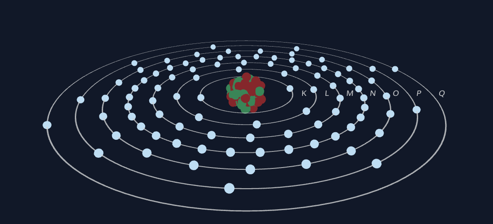

# 3D Atomic Model Visualizer

[](https://supernvx.github.io/Atomus/)

An interactive 3D visualization tool for atomic models, designed for educational purposes to help students understand atomic structure and quantum mechanics concepts through visual representations.

## Features

- **Interactive 3D Models**: Visualize different atomic models including:
  - Dalton Model
  - Thomson Model  
  - Rutherford Model
  - Bohr Model
  - Sommerfeld Model
  - Schrödinger Model

- **Adjustable Parameters**: 
  - Protons, neutrons, and electrons sliders
  - Orbit thickness control
  - Electron shell configuration

- **Educational Controls**:
  - Simulation of atomic excitation (for Bohr model)
  - Interactive timeline to switch between models
  - Information panels with atomic data

- **High-Quality Visuals**:
  - Smooth 3D rendering using Three.js
  - Optimized performance with React Three Fiber
  - Vector-style orbitals with adjustable thickness

## Preview



## Models Included

### Classical Models
- **Dalton Model**: Simple solid sphere representation
- **Thomson Model**: "Plum pudding" model with charges distributed in a sphere
- **Rutherford Model**: Nuclear model with orbiting electrons

### Quantum Models  
- **Bohr Model**: Planetary model with defined electron shells
- **Sommerfeld Model**: Extended Bohr model with elliptical orbits
- **Schrödinger Model**: Quantum mechanical probability clouds

## Getting Started

### Prerequisites
- Node.js (version 16 or higher)
- npm or yarn package manager

### Installation

1. Clone the repository:
```bash
git clone <repository-url>
```

2. Navigate to the project directory:
```bash
cd <project-name>
```

3. Install dependencies:
```bash
npm install
```

4. Start the development server:
```bash
npm run dev
```

5. Open your browser and go to `http://localhost:5173`

### Building for Production

To create a production build:

```bash
npm run build
```

The built files will be in the `dist` folder.

## Project Structure

```
├── components/           # React components for atomic models
├── components/animated/  # Animated components (electron orbits)
├── data/                 # Atomic data and model configurations
├── types.ts              # TypeScript type definitions
├── constants.ts          # Color and configuration constants
├── App.tsx               # Main application component
├── index.html            # HTML entry point
└── vite.config.ts        # Vite build configuration
```

## Technologies Used

- 
- 
- 
- 
- 
- 

## Educational Use Cases

This application is designed to support various educational scenarios:

- **Chemistry Classes**: Understanding atomic structure evolution
- **Physics Courses**: Exploring quantum mechanics concepts
- **Interactive Demonstrations**: Visualizing atomic models in real-time
- **Comparative Analysis**: Comparing different atomic models side-by-side

## Contributing

Contributions are welcome! Feel free to submit pull requests for:
- Educational features
- Performance improvements
- Bug fixes

## License

This project is open source and available under the [MIT License](LICENSE).